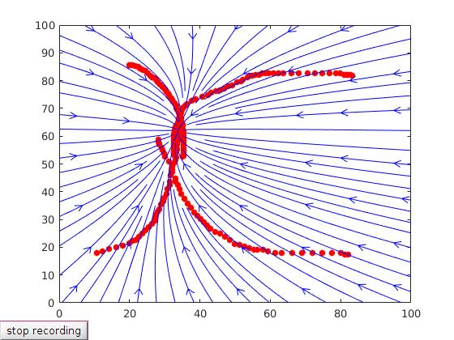

# stable_lds
This simple repository provides MATLAB code to estimate a linear dynamical system from data using a convex optimization. It uses YAMLIP and the sedumi solver. To run the code first init and update the respective submodules. In the terminal, go to yout stable_lds folder
```
$ cd your_stable_lds_folder
```
then
```
$ git submodule update --init --recursive
```
To run the demo, in the MATLAB command window run
```
>> demo
```
A figure will pop up where you can draw as many trajectories as you want. Once you are done click 'stop recording' and you will see the streamlines of the resulting dynamical system

