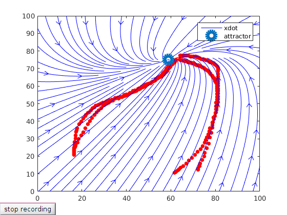

# stable_lds
This repository provides MATLAB code to estimate stable dynamical systems from data. It uses <a href="https://yalmip.github.io/">YALMIP</a> and includes the sedumi solver as a submodule, but you can use any other solver of your choice supported by YALMIP (check <a href="https://yalmip.github.io/allsolvers/">here</a> for a list of supported solvers). To run the code first init and update the respective submodules. In the terminal, go to your stable_lds folder
```
$ cd your_stable_lds_folder
```
then
```
$ git submodule update --init --recursive
```
This repo provides three different methods:
  - An estimator for a <b>stable linear dynamical system</b> (estimate_stable_lds.m)
  - An estimator for a <b>stable linear dynamical system with an inverse formulation</b> (estimate_stable_inv_lds.m)
  - An estimator for a <b>stable nonlinear dynamical system as a mixture of linear dynamical systems</b> that relies on an inverse formulation (em_mix_inv_lds.m and estimate_mix_inv_lds.m)

All three methods estimate <i>both the dynamics and the attractor</i> but if you prefer you can specify the attractor a priori. In the MATLAB command window type
```
>> help the_filename_you_want.m
```
to get an explanation of the methods and of the interface of how to set this option and many others.

To test the code there are three demos, one for each method. To run them, in the MATLAB command window run
```
>> demo_lds
```
for the <b>stable linear dynamical system</b> estimator. A figure will pop up where you can draw as many trajectories as you want. Once you are done click 'stop recording' and you will see the streamlines of the resulting dynamical system as here


You will get an equivalent demo and interface for the <b>stable linear dynamical system with an inverse procedure</b> 
```
>> demo_inv_lds
```


And also for the <b>stable nonlinear dynamical system as a mixture of linear dynamical systems</b>. 
```
>> demo_mix_inv_lds
```

